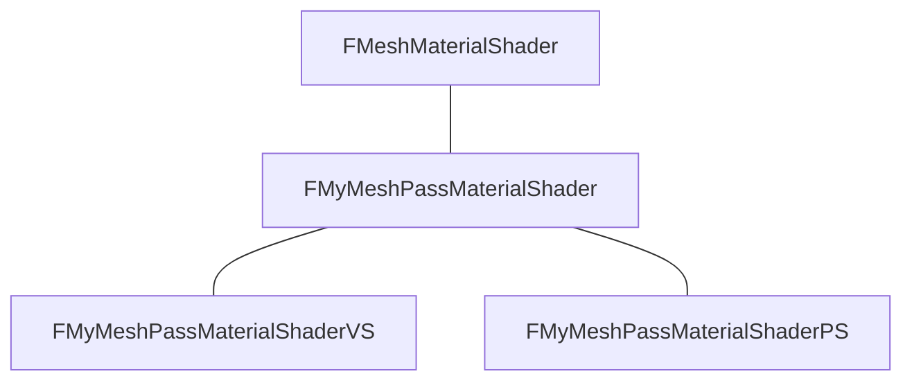
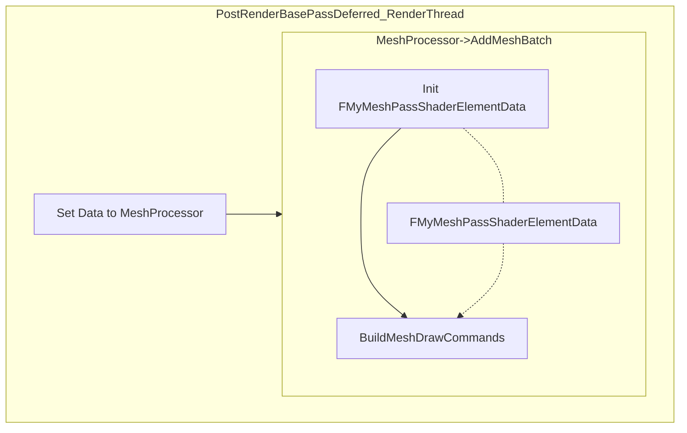

# Add a Mesh Pass without Touching Unreal Engine Source Code

Tags: 个人笔记, 渲染
Category: Tutorial

I often encounter such a demand: I hope to be able to quickly do some rendering-related experiments in Unreal Engine, but if I need to modify the engine source code and compile every time, it will make my work very complicated. Moreover, this also makes it difficult for me to share my achievements with others.

In the era of UE4, it is almost inevitable to insert your own rendering code and compile the source code of the engine. But in UE5, the rendering code of Unreal Engine has become flexible enough to make me want to try whether I can achieve the goal of "rendering certain meshes in the scene with my own Shader" without modifying the official source code of Unreal, through plugins.

<aside>
ℹ️ The source code is on the Github: https://github.com/ldl19691031/AddMeshPassPlugin

</aside>

# 🎯 Target

- Render a part of meshes in the scene to our own render target texture,
- with our own shaders,
- but not modify the engine’s source code directly,
- only do this in a plugin.

<aside>
⚠️ Warning before reading: The method written in this article has only been used by me for prototype development, and I have never used the above method in a production environment. If you wish to significantly modify the rendering code, please be sure to contact the Epic development team. Please note: My purpose is to illustrate "it can be done this way", but it is not to illustrate "you should do it this way".

</aside>

# ⛰️ Environment

- Engine : ue5-main in 2024/5/18
    - But I tested in 5.4.1 (Launcher version) , it also works
    - If you want to use earlier version, you need to modify some API calls to fixe errors.

# ⚙️ Create a Plugin

Instead of working in the project’s source folder, I usually choose to create an individual plugin. 

First you should create a new plugin, the simplest way is open Plugins menu


Click the Add Button


And create a Blank plugin


I will call this plugin ‘AddMeshPassPlugin’. You can choose any name you prefer.


If you want  to know more about plugins:

[Unreal Engine でのプラグイン | Unreal Engine 5.4 ドキュメンテーション | Epic Developer Community](https://dev.epicgames.com/documentation/ja-jp/unreal-engine/plugins-in-unreal-engine)

## Change the Loading Phase

You must change the plugin’s module’s loading phase from `Default` to `PostConfigInit` . In my case the file is `AddMeshPassPlugin.uplugin`


<aside>
❓ Because we need to add our custom shaders. If you want to know more:

[Shader Development](https://docs.unrealengine.com/4.26/en-US/ProgrammingAndScripting/Rendering/ShaderDevelopment/)

</aside>

## Reference Render Modules

Inside your plugin’s `.Build.cs` file, you should add the following modules as dependency modules.


```cpp
				      	"ApplicationCore",
                "Core",
                "DeveloperSettings",
                "Projects",
                "RHI",
                "RenderCore",
                "Renderer",
```

## Add Source Files

You should add: a `RenderMyMeshPass.h/cpp` file, and a shader file. Again, you can choose any name you want.


But keep in mind, your folder structure is important. If you are not familiar with the shader programming, please follow my folder and file names.

# 🏗️ Architecture

The classes we need are:

- UMyMeshPassManager :  A world subsystem as a manager, which is in the game thread.
- FMyMeshPassViewExtension : View extension is used to inject our rendering code to the unreal engine’s rendering pipeline.
- URenderInMyMeshPassStaticMeshComponent : We only want to render the static meshes in this class.

# 👤 Usage Example

From a user’s view, what you need to do is:

- Create a BP class based on URenderInMyMeshPassStaticMeshComponent. (optional)


- Put an Actor into the scene


- Add BP component to that Actor


- Open the RT_Output render target texture in the plugin’s content folder, you will see this cube is also rendered to the RT_Output.


Currently it works like a SceneCapture2D. But the cube is actually rendered with your own shader.

# Process Overview

Let me explain what happens:

- In the beginning, UMyMeshPassManager initialize the FMyMeshPassViewExtension and register that to the engine


- When a 🧊 URenderInMyMeshPassStaticMeshComponent is initialized, it will register itself to the manager.


- Before rendering, in game thread, unreal calls `SetupViewFamily` of our  FMyMeshPassViewExtension, this is the time we can collect  URenderInMyMeshPassStaticMeshComponent info, put them into an array for rendering.
- After unreal renders BasePass, it will trigger the `PostRenderBasePassDeferred_RenderThread` function in  FMyMeshPassViewExtension. So we can put our render code there.
    - We will discuss the render code later.
- Our customized rendering code is output to another render target texture, not the unreal engine’s.


# Manager

## Subsystem

Our UMyMeshPassManager is a World Subsystem. This is because if we don’t have a world, no need to render our mesh anymore. 

Subsystem is a kind of singletons in the unreal engine (but they are not equal. For example, you may have two instances of one world subsystem).

If you want to know more about subsystems:

[Programming Subsystems](https://docs.unrealengine.com/4.27/en-US/ProgrammingAndScripting/Subsystems/)

## Initialization

```cpp
void UMyMeshPassManager::Initialize(FSubsystemCollectionBase& Collection)
{
	Super::Initialize(Collection);
	MyMeshPassOutputRT = MyMeshPassOutput.LoadSynchronous(); // 1
	check(MyMeshPassOutputRT);
	//2
	MyMeshPassViewExtension = FSceneViewExtensions::NewExtension<FMyMeshPassViewExtension>(GetWorld());
}
```

We did two thing in the initialization of our manager:

1. Load our render target texture. 
    
    Reason: I hard-coded the output render target texture’s path, which should be avoided when using in production.
    
    ```cpp
    TSoftObjectPtr<class UTextureRenderTarget2D> UMyMeshPassManager::MyMeshPassOutput(FSoftObjectPath("/Script/Engine.TextureRenderTarget2D'/AddMeshPassPlugin/RT_Output.RT_Output'"));
    ```
    
2. We instanced our view port extension. With FSceneViewExtensions::NewExtension, your extension will be automatically registered.
    
    Remember to save the instance to a `TSharedPtr<FMyMeshPassViewExtension, ESPMode::ThreadSafe>` member. This will makes the extension’s life time equals to the manager.
    

# Component

Our URenderInMyMeshPassStaticMeshComponent just contains register code.

```cpp
void URenderInMyMeshPassStaticMeshComponent::OnRegister()
{
	Super::OnRegister();
	//register self to the manager
	UMyMeshPassManager* Manager = GetWorld()->GetSubsystem<UMyMeshPassManager>();
	if (Manager)
	{
		Manager->RegisterComponent(this);
	}
	//...
}

void URenderInMyMeshPassStaticMeshComponent::OnUnregister()
{
	Super::OnUnregister();
	//unregister self from the manager
	UMyMeshPassManager* Manager = GetWorld()->GetSubsystem<UMyMeshPassManager>();
	if (Manager)
	{
		Manager->UnregisterComponent(this);
	}
	//...
}
```

# Collect Rendering Data

In order to render URenderInMyMeshPassStaticMeshComponent s, we need to collect them, and convert to render proxies. If you are not familiar with render proxies and mesh batches, I recommend you to read the following first:

- [The official rendering guide](https://docs.unrealengine.com/4.27/en-US/ProgrammingAndScripting/Rendering/MeshDrawingPipeline/)
- [My old articles](https://howuerenderacube.super.site/)

If you need a quick summary:

- U-Components are the components in the game world. If you are a gameplay programmer, you almost play with them everyday.
- F-RenderProxy holds data of a game world component. It is used by render thread.
- MeshBatch is a part of one mesh’s render proxy in one material. Remember, one mesh can have many materials. We need to separately render them.

Inside the `SetupViewFamily` function, we get all the URenderInMyMeshPassStaticMeshComponent s from UMyMeshPassManager , and convert them into a render proxy array.


```cpp
void FMyMeshPassViewExtension::SetupViewFamily(FSceneViewFamily& InViewFamily)
{
	check(IsInGameThread());
	MyMeshPassPrimitives.Empty();
	if (this->GetWorld())
	{
		UMyMeshPassManager* Manager = this->GetWorld()->GetSubsystem<UMyMeshPassManager>();
		if (Manager)
		{
			for (URenderInMyMeshPassStaticMeshComponent* Component : Manager->GetRegisteredComponents())
			{
				if (Component && Component->IsVisible())
				{
					MyMeshPassPrimitives.Add(Component->GetSceneProxy());
				}
			}

			//...
		}
	}
	
}
```

# View Port Resize

[testProj_5_2Editor-Win64-DebugGame_bsdGfDAtwc.mp4](Add%20a%20Mesh%20Pass%20without%20Touching%20Unreal%20Engine%20Sou%20fe105e36f9a649b18b37b8fa46c687ee/testProj_5_2Editor-Win64-DebugGame_bsdGfDAtwc.mp4)

We also need to deal with one problem: if we changes our view port’s size, we also need to change the render target texture’s size. 

```cpp
const FIntPoint RenderTargetSize = InViewFamily.RenderTarget->GetSizeXY();
			UTextureRenderTarget2D* MyMeshPassOutputRT = Manager->GetMyMeshPassOutputRT();
			if (MyMeshPassOutputRT->SizeX != RenderTargetSize.X 
				|| MyMeshPassOutputRT->SizeY != RenderTargetSize.Y)
			{
				MyMeshPassOutputRT->ResizeTarget(RenderTargetSize.X, RenderTargetSize.Y);
				//We must flush rendering commands here to make sure the render target is ready for rendering
				FlushRenderingCommands();
			}
```

We need to do this in the game thread, so I choose to do in `SetupViewFamily` function

`FlushRenderingCommands();` is needed because `ResizeTarget` function is not update the resources on the GPU immediately. Instead, it sends a task to the render thread and directly return. So if we access the target later, we may still see a render target with the old size.

# Prepare Shaders

## Shader Source File

You should create a shader source file inside the Shaders folder first.


And we also need to tell the engine about how this shader should be referenced, in the `StartupModule`function.

```cpp
void FAddMeshPassPluginModule::StartupModule()
{
	// This code will execute after your module is loaded into memory; the exact timing is specified in the .uplugin file per-module
	FString PluginShaderDir = FPaths::Combine(IPluginManager::Get().FindPlugin(TEXT("AddMeshPassPlugin"))->GetBaseDir(), TEXT("Shaders"));
	AddShaderSourceDirectoryMapping(TEXT("/Plugin/Runtime/AddMeshPassPlugin"), PluginShaderDir);

}
```

<aside>
❓ You may be confused as to why the path here is not the real Shader path? In fact, the Unreal Engine uses key-value pairs to reference Shaders. This allows the engine to access Shaders via virtual paths. In other words, you should consider "`/Plugin/Runtime/AddMeshPassPlugin`" as a virtual path. This path is mapped to the real path `<Your Plugin Root Directory>/Shaders` through the above code.

</aside>

## Shader Declaration in C++

We need a pair of Vertex Shader and Pixel Shader to render our mesh.



- Why `FMeshMaterialShader` ?
    - Because we still want to use Material graphics.

I have nothing to discuss with these classes, so I just put the code below if you want to quickly have a look:

- Shader Declaration Code
    
    ```cpp
    class FMyMeshPassMaterialShader : public FMeshMaterialShader {
    public:
    	FMyMeshPassMaterialShader(const FMeshMaterialShaderType::CompiledShaderInitializerType& Initializer)
    		: FMeshMaterialShader(Initializer) 
    	{
    		PassUniformBuffer.Bind(Initializer.ParameterMap, FSceneTextureUniformParameters::FTypeInfo::GetStructMetadata()->GetShaderVariableName());
    	}
    
    	FMyMeshPassMaterialShader() {}
    
    	static bool ShouldCompilePermutation(const FMeshMaterialShaderPermutationParameters& Parameters)
    	{
    		return IsFeatureLevelSupported(Parameters.Platform, ERHIFeatureLevel::SM5);
    	}
    };
    
    class FMyMeshPassMaterialShaderVS : public FMyMeshPassMaterialShader
    {
    	DECLARE_SHADER_TYPE(FMyMeshPassMaterialShaderVS, MeshMaterial);
    
    public:
    	FMyMeshPassMaterialShaderVS()
    	{}
    
    	FMyMeshPassMaterialShaderVS(const FMeshMaterialShaderType::CompiledShaderInitializerType& Initializer)
    		: FMyMeshPassMaterialShader(Initializer)
    	{
    	}
    };
    IMPLEMENT_MATERIAL_SHADER_TYPE(, FMyMeshPassMaterialShaderVS, TEXT("/Plugin/Runtime/AddMeshPassPlugin/MyMeshPassMaterialShader.usf"), TEXT("VSMain"), SF_Vertex);
    
    class FMyMeshPassMaterialShaderPS : public FMyMeshPassMaterialShader
    {
    	DECLARE_SHADER_TYPE(FMyMeshPassMaterialShaderPS, MeshMaterial);
    
    public:
    	FMyMeshPassMaterialShaderPS()
    	{}
    
    	FMyMeshPassMaterialShaderPS(const ShaderMetaType::CompiledShaderInitializerType& Initializer)
    		: FMyMeshPassMaterialShader(Initializer)
    	{
    	}
    };
    IMPLEMENT_MATERIAL_SHADER_TYPE(, FMyMeshPassMaterialShaderPS, TEXT("/Plugin/Runtime/AddMeshPassPlugin/MyMeshPassMaterialShader.usf"), TEXT("PSMain"), SF_Pixel);
    ```
    

## Shader Code

Our shader code is just a simple shader file contains a minimal vertex and pixel shader. They are communicated with `FRenderMyMeshVSToPS` struct, which is passed from VS to PS.

```cpp
#include "/Engine/Private/Common.ush"
#include "/Engine/Generated/Material.ush"
#include "/Engine/Generated/VertexFactory.ush"

struct FRenderMyMeshVSToPS
{
    FVertexFactoryInterpolantsVSToPS FactoryInterpolants;
    float4 Position : SV_POSITION;
};

/** Simple default vertex shader. */
void VSMain(
	FVertexFactoryInput Input,
	out FRenderMyMeshVSToPS Output
)
{
	//...
}

void PSMain(
	FRenderMyMeshVSToPS Interpolants
	OPTIONAL_IsFrontFace,
	out HALF4_TYPE OutColor : SV_Target0
)
{
    //...
}
```

Let’s skip the function body currently, because I will tell you the details when we dealing with each materials.

# Prepare Geometries (Mesh Batches)

Now this is a complex part.

If you are familiar with unreal engine’s mesh rendering pipeline, you definitely see this image before:


This image tells you, you need to have a FMeshPassProcessor to convert the FMeshBatch to the FMeshDrawCommands. And at this time you can change depth stencil state, you can assign shaders…

So let’s have a mesh processor:

## Mesh Processor

```cpp
class FMyMeshPassProcessor : public FMeshPassProcessor
{
public:
	FMyMeshPassProcessor(
			const FScene* InScene, 
			const FSceneView* InViewIfDynamicMeshCommand, 
			FMeshPassDrawListContext* InDrawListContext)
		: FMeshPassProcessor(
			EMeshPass::Num,
			InScene, 
			InViewIfDynamicMeshCommand->GetFeatureLevel(), InViewIfDynamicMeshCommand, InDrawListContext
		)
	{
		//...1
	}

	virtual void AddMeshBatch(const FMeshBatch& RESTRICT MeshBatch, uint64 BatchElementMask, const FPrimitiveSceneProxy* RESTRICT PrimitiveSceneProxy, int32 StaticMeshId = -1) override;
	
	FMeshPassProcessorRenderState PassDrawRenderState;
};
```

This is almost the simplest mesh processor. Only two functions we need to take a look: the constructor and the `AddMeshBatch` function.

The constructor is used to initialize our `PassDrawRenderState`. Here you can modify the blend mode and the depth stencil state. For example if you want to turn off the depth compare feature, here is the time.

```cpp
	FMyMeshPassProcessor(
			const FScene* InScene, 
			const FSceneView* InViewIfDynamicMeshCommand, 
			FMeshPassDrawListContext* InDrawListContext)
		: FMeshPassProcessor(
			EMeshPass::Num,  //<-- Is this OK?
			InScene, 
			InViewIfDynamicMeshCommand->GetFeatureLevel(), InViewIfDynamicMeshCommand, InDrawListContext
		)
	{
		PassDrawRenderState.SetBlendState(TStaticBlendState<>::GetRHI());
		PassDrawRenderState.SetDepthStencilState(TStaticDepthStencilState<>::GetRHI());
	}
```

## Add Mesh Batch

The `AddMeshBatch` function should:

- Get the material render proxy. → Provide shaders
- Get the vertex factory → Provide meshes ( primitives / geometries)
- Get the shader element data → Skip at this moment
- Call `BuildMeshDrawCommands` function, build the actual render command.

```cpp
inline void FMyMeshPassProcessor::AddMeshBatch(const FMeshBatch& RESTRICT MeshBatch, uint64 BatchElementMask, const FPrimitiveSceneProxy* RESTRICT PrimitiveSceneProxy, int32 StaticMeshId)
{
	const FMaterialRenderProxy* MaterialRenderProxy = MeshBatch.MaterialRenderProxy;
	while (MaterialRenderProxy)
	{
		const FMaterial* Material = MaterialRenderProxy->GetMaterialNoFallback(FeatureLevel);
		if (Material)
		{
			const FVertexFactory* VertexFactory = MeshBatch.VertexFactory;

			TMeshProcessorShaders<
				FMyMeshPassMaterialShaderVS,
				FMyMeshPassMaterialShaderPS> PassShaders;

			FMaterialShaderTypes ShaderTypes;
			ShaderTypes.AddShaderType<FMyMeshPassMaterialShaderVS>();
			ShaderTypes.AddShaderType<FMyMeshPassMaterialShaderPS>();

			FMaterialShaders Shaders;
			if (!Material->TryGetShaders(ShaderTypes, VertexFactory->GetType(), Shaders))
			{
				MaterialRenderProxy = MaterialRenderProxy->GetFallback(FeatureLevel);
				continue;
			}
			Shaders.TryGetVertexShader(PassShaders.VertexShader);
			Shaders.TryGetPixelShader(PassShaders.PixelShader);

			const FMeshDrawingPolicyOverrideSettings OverrideSettings = ComputeMeshOverrideSettings(MeshBatch);
			const ERasterizerFillMode MeshFillMode = ComputeMeshFillMode(*Material, OverrideSettings);
			const ERasterizerCullMode MeshCullMode = CM_None;

			const FMeshDrawCommandSortKey SortKey = CalculateMeshStaticSortKey(PassShaders.VertexShader, PassShaders.PixelShader);

			FMeshMaterialShaderElementData ShaderElementData;
			ShaderElementData.InitializeMeshMaterialData(ViewIfDynamicMeshCommand, PrimitiveSceneProxy, MeshBatch, -1, true);

			BuildMeshDrawCommands(
				MeshBatch,
				BatchElementMask,
				PrimitiveSceneProxy,
				*MaterialRenderProxy,
				*Material,
				PassDrawRenderState,
				PassShaders,
				MeshFillMode,
				MeshCullMode,
				SortKey,
				EMeshPassFeatures::Default,
				ShaderElementData
			);

			break;
		}

		MaterialRenderProxy = MaterialRenderProxy->GetFallback(FeatureLevel);
	}

}
```

You may have a set of questions:

### Vertex Factory

This one help us to avoid think about what kind of mesh we are dealing with: a static mesh? a skeletal mesh (also this is impossible in our case).

### Material Shaders

Wait, you may want to ask: why do we need to get shaders from each material? Didn’t we just write by ourselves just before?

No, you are just write A PART of the final shader. I skipped the discussion before, now let’s take a look:

```cpp
void VSMain(
	FVertexFactoryInput Input,
	out FRenderMyMeshVSToPS Output
)
{
	ResolvedView = ResolveView();
	FVertexFactoryIntermediates VFIntermediates = GetVertexFactoryIntermediates(Input);
	float4 WorldPosition = VertexFactoryGetWorldPosition(Input, VFIntermediates);

	half3x3 TangentToLocal = VertexFactoryGetTangentToLocal(Input, VFIntermediates);
	FMaterialVertexParameters VertexParameters = GetMaterialVertexParameters(Input, VFIntermediates, WorldPosition.xyz, TangentToLocal);
	Output.FactoryInterpolants = VertexFactoryGetInterpolantsVSToPS(Input, VFIntermediates, VertexParameters);

	WorldPosition.xyz += GetMaterialWorldPositionOffset(VertexParameters);
	float4 RasterizedWorldPosition = VertexFactoryGetRasterizedWorldPosition(Input, VFIntermediates, WorldPosition);
	Output.Position = mul(RasterizedWorldPosition, ResolvedView.TranslatedWorldToClip);
}

void PSMain(
	FRenderMyMeshVSToPS Interpolants
	OPTIONAL_IsFrontFace,
	out HALF4_TYPE OutColor : SV_Target0
)
{
    ResolvedView = ResolveView();

    float4 SvPosition = Interpolants.Position;
    FMaterialPixelParameters MaterialParameters = GetMaterialPixelParameters(Interpolants.FactoryInterpolants, SvPosition);

    FPixelMaterialInputs PixelMaterialInputs;
    CalcMaterialParameters(MaterialParameters, PixelMaterialInputs, SvPosition, bIsFrontFace);
    GetMaterialCoverageAndClipping(MaterialParameters, PixelMaterialInputs);

	//In the case if you need access material parameters
    float3 BaseColor = GetMaterialBaseColor(PixelMaterialInputs);
    OutColor = float4(BaseColor, 1.0f);
}
```

You can see these function calls:

```cpp
    FMaterialPixelParameters MaterialParameters = GetMaterialPixelParameters(Interpolants.FactoryInterpolants, SvPosition);
    FPixelMaterialInputs PixelMaterialInputs;
    CalcMaterialParameters(MaterialParameters, PixelMaterialInputs, SvPosition, bIsFrontFace);
    GetMaterialCoverageAndClipping(MaterialParameters, PixelMaterialInputs);
```

After these call, you can get result from each material’s graph’s output node. I just use `GetMaterialBaseColor` function as an example.


So the question is: why we can get different `PixelMaterialInputs`  with the same shader code? This is because each material will generate it’s own content of  `CalcMaterialParameters` . And then build the final VS and PS. (If you want to know more, check ShaderMap)

Takeaway: our `MyMeshPassMaterialShader.usf` is just a template. The real shaders are generated by each material.

# Execute the Rendering

Now let’s discuss the real rendering part:


The code does the following steps:

- Create the pass parameters
- Create the output render targets
- Call `AddSimpleMeshPass` :
    - Give all the render proxies we collected in [Collect Rendering Data](https://www.notion.so/Collect-Rendering-Data-c475d72d7d894bb4a5f4bbaa562dea45?pvs=21)
    - Call the `MeshProcessor` to convert mesh batches to mesh commands
- Later, the mesh commands are executed, so we can get the output in our render targets
- If you want to check the code
    
    ```cpp
    BEGIN_SHADER_PARAMETER_STRUCT(FRenderMyMeshPassParameters, )
    	SHADER_PARAMETER_STRUCT_REF(FViewUniformShaderParameters, View)
    	SHADER_PARAMETER_RDG_UNIFORM_BUFFER(FSceneUniformParameters, Scene)
    	SHADER_PARAMETER_STRUCT_INCLUDE(FInstanceCullingDrawParams, InstanceCullingDrawParams)
    	RENDER_TARGET_BINDING_SLOTS()
    END_SHADER_PARAMETER_STRUCT()
    
    void FMyMeshPassViewExtension::PostRenderBasePassDeferred_RenderThread(FRDGBuilder& GraphBuilder, FSceneView& View, const FRenderTargetBindingSlots& RenderTargets, TRDGUniformBufferRef<FSceneTextureUniformParameters> SceneTextures)
    {
    	//...
    	FRDGTextureRef DepthTexture = GraphBuilder.CreateTexture(
    		FRDGTextureDesc::Create2D(RenderTargetSize, PF_DepthStencil, FClearValueBinding::DepthFar, TexCreate_DepthStencilTargetable),
    		TEXT("RenderMyMeshPassTempDepth"));
    	const FTextureRHIRef SourceTexture = MyMeshPassOutputRTResource->GetTexture2DRHI();
    	FRDGTextureRef MyMeshPassOutputTexture = GraphBuilder.RegisterExternalTexture(CreateRenderTarget(SourceTexture, TEXT("OutputRT")));
    	auto* PassParameters = GraphBuilder.AllocParameters<FRenderMyMeshPassParameters>();
    	PassParameters->View = View.ViewUniformBuffer;
    	PassParameters->Scene = GetSceneUniformBufferRef(GraphBuilder, View);
    	PassParameters->RenderTargets[0] = FRenderTargetBinding(MyMeshPassOutputTexture, ERenderTargetLoadAction::EClear);
    	PassParameters->RenderTargets.DepthStencil = FDepthStencilBinding(DepthTexture, ERenderTargetLoadAction::EClear, ERenderTargetLoadAction::ENoAction, FExclusiveDepthStencil::DepthWrite_StencilNop);
    	
    	TArray< const FPrimitiveSceneProxy* > RenderedPrimitives = MyMeshPassPrimitives;
    
    	AddSimpleMeshPass(
    		GraphBuilder, 
    		PassParameters, 
    		View.Family->Scene->GetRenderScene(), 
    		View, 
    		nullptr, 
    		RDG_EVENT_NAME("RenderMyMeshPass"), 
    		View.UnscaledViewRect,
    		[View, RenderedPrimitives](FDynamicPassMeshDrawListContext* DynamicMeshPassContext)
    	{
    		FMyMeshPassProcessor PassMeshProcessor(nullptr, &View, DynamicMeshPassContext);
    		for (const FPrimitiveSceneProxy* primitive : RenderedPrimitives)
    		{
    			const FStaticMeshSceneProxy* MeshProxy = static_cast<const FStaticMeshSceneProxy*>(primitive);
    			int32 LODIndex = 0;
    			TArray<FMeshBatch> MeshElements;
    			primitive->GetMeshDescription(LODIndex, MeshElements);
    			if (MeshElements.Num() == 0)
    			{
    				continue;
    			}
    			PassMeshProcessor.AddMeshBatch(MeshElements[0], 1, primitive);
    		}
    	});
    }
    ```
    

## Pass Parameters

Think about these question:

- How can we set the 🎦 camera matrix? → We need to pass View info to our shader
- How can we get the object’s transform? → We need to pass Scene data
- And, we need to pass instance culling data

So our pass parameters contains these three info:

```cpp
BEGIN_SHADER_PARAMETER_STRUCT(FRenderMyMeshPassParameters, )
	SHADER_PARAMETER_STRUCT_REF(FViewUniformShaderParameters, View)
	SHADER_PARAMETER_RDG_UNIFORM_BUFFER(FSceneUniformParameters, Scene)
	SHADER_PARAMETER_STRUCT_INCLUDE(FInstanceCullingDrawParams, InstanceCullingDrawParams)
	RENDER_TARGET_BINDING_SLOTS()
END_SHADER_PARAMETER_STRUCT()
```

## Add Simple Mesh Pass

This is the interesting point I found. With this function, you can add a mesh pass without adding a new item into `EMeshPass`, which means we can avoid touching engine’s source code.


Short answer: performance.

So as I said in the beginning, you should only think about using this if:

- You just need to test some graphics programming ideas. If that idea works, you will modify the engine and use that as a new custom pass.
- You want to make an editor-only tool.

My explanation of the plugin code is ended here. Now let’s take a look at some interesting usage:

# Passing Custom Data

You want to add a new property to URenderInMyMeshPassStaticMeshComponent


And you can get the data inside your shader:

```cpp
float3 ExampleColorProperty;

void PSMain(
	FRenderMyMeshVSToPS Interpolants
	OPTIONAL_IsFrontFace,
	out HALF4_TYPE OutColor : SV_Target0
)
{
	  //...
    OutColor = float4(BaseColor + ExampleColorProperty, 1.0f);
}
```

Like this:


First you need to add a custom property:

```cpp
UPROPERTY(EditAnywhere, BlueprintReadWrite, Category = "MyMeshPass")
FVector ExampleColorProperty;
```

Then you need to make a TMap to record each `FPrimitiveSceneProxy` ‘s data, which is also fine:

```cpp
class FMyMeshPassViewExtension : public FWorldSceneViewExtension
{
	//...
	struct FAdditionalData {
		FVector ExampleColorProperty;
	};
	TMap<const FPrimitiveSceneProxy*, FAdditionalData> MyMeshPassPrimitivesData;
};
```

But how can we pass the data to shader? 

- Create a `FMyMeshPassShaderElementData`
    
    ```cpp
    struct FMyMeshPassShaderElementData : public FMeshMaterialShaderElementData
    {
    	FVector3f ExampleColorProperty;
    };
    ```
    
- Create a `FShaderParameter` in the Pixel Shader
- Implement `GetShaderBindings` function

```cpp
class FMyMeshPassMaterialShaderPS : public FMyMeshPassMaterialShader
{
	//...
	FMyMeshPassMaterialShaderPS(const ShaderMetaType::CompiledShaderInitializerType& Initializer)
		: FMyMeshPassMaterialShader(Initializer)
	{
		ExampleColorProperty.Bind(Initializer.ParameterMap, TEXT("ExampleColorProperty"));
	}

	void GetShaderBindings(...) const
	{
		//...
		ShaderBindings.Add(ExampleColorProperty, ShaderElementData.ExampleColorProperty);
	}
	LAYOUT_FIELD(FShaderParameter, ExampleColorProperty);
};
```

The data is passed like:



- If you want to check the code
    
    PostRenderBasePassDeferred_RenderThread
    
    ```cpp
    TArray< const FPrimitiveSceneProxy* > RenderedPrimitives = MyMeshPassPrimitives;
    	TMap< const FPrimitiveSceneProxy*, FAdditionalData> RenderedPrimitivesData = this->MyMeshPassPrimitivesData;
    	AddSimpleMeshPass(
    		GraphBuilder, 
    		PassParameters, 
    		View.Family->Scene->GetRenderScene(), 
    		View, 
    		nullptr, 
    		RDG_EVENT_NAME("RenderMyMeshPass"), 
    		View.UnscaledViewRect,
    		[View, RenderedPrimitives, RenderedPrimitivesData](FDynamicPassMeshDrawListContext* DynamicMeshPassContext)
    	{
    		FMyMeshPassProcessor PassMeshProcessor(nullptr, &View, DynamicMeshPassContext);
    		for (const FPrimitiveSceneProxy* primitive : RenderedPrimitives)
    		{
    			if (primitive == nullptr)
    			{
    				continue;
    			}
    			const FStaticMeshSceneProxy* MeshProxy = static_cast<const FStaticMeshSceneProxy*>(primitive);
    			int32 LODIndex = 0;
    			TArray<FMeshBatch> MeshElements;
    			primitive->GetMeshDescription(LODIndex, MeshElements);
    			if (MeshElements.Num() == 0)
    			{
    				continue;
    			}
    			PassMeshProcessor.MyMeshPassPrimitivesData = RenderedPrimitivesData[primitive];
    			PassMeshProcessor.AddMeshBatch(MeshElements[0], 1, primitive);
    		}
    	});
    ```
    
    AddMeshBatch
    
    ```cpp
    inline void FMyMeshPassProcessor::AddMeshBatch(const FMeshBatch& RESTRICT MeshBatch, uint64 BatchElementMask, const FPrimitiveSceneProxy* RESTRICT PrimitiveSceneProxy, int32 StaticMeshId)
    {
    	const FMaterialRenderProxy* MaterialRenderProxy = MeshBatch.MaterialRenderProxy;
    	while (MaterialRenderProxy)
    	{
    		const FMaterial* Material = MaterialRenderProxy->GetMaterialNoFallback(FeatureLevel);
    		if (Material)
    		{
    			//...
    			FMyMeshPassShaderElementData ShaderElementData;
    			ShaderElementData.InitializeMeshMaterialData(ViewIfDynamicMeshCommand, PrimitiveSceneProxy, MeshBatch, -1, true);
    			ShaderElementData.ExampleColorProperty = FVector3f(MyMeshPassPrimitivesData.ExampleColorProperty.X, MyMeshPassPrimitivesData.ExampleColorProperty.Y,
    				MyMeshPassPrimitivesData.ExampleColorProperty.Z);
    
    			BuildMeshDrawCommands(
    				MeshBatch,
    				BatchElementMask,
    				PrimitiveSceneProxy,
    				*MaterialRenderProxy,
    				*Material,
    				PassDrawRenderState,
    				PassShaders,
    				MeshFillMode,
    				MeshCullMode,
    				SortKey,
    				EMeshPassFeatures::Default,
    				ShaderElementData
    			);
    
    			break;
    		}
    
    		MaterialRenderProxy = MaterialRenderProxy->GetFallback(FeatureLevel);
    	}
    
    }
    ```
    

<aside>
ℹ️ There are a lot of ways, I just use this as an example.

</aside>

# References

- I recommend you to check `Engine\Plugins\Runtime\RenderTrace\Source\Private\RenderTrace.cpp`