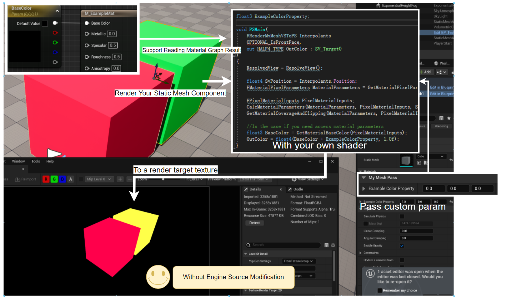

<br />
<div align="center">
  <h3 align="center">Add Mesh Pass in Unreal Engine Plugin</h3>

  <p align="center">
    An example of adding a mesh pass without touching unreal engine's source code
  </p>
</div>

## About The Project


This is the sample project of [this article](https://golden-mandolin-675.notion.site/Add-a-Mesh-Pass-without-Touching-Unreal-Engine-Source-Code-fe105e36f9a649b18b37b8fa46c687ee). If you want to know more, please read that article.

The project shows that you can use AddSimpleMeshPass function to render the meshes you want, with your custom shaders, no need to touch engine source code.

I use this as a graphics prototype tool in Unreal Engine. Don't use this in production.

## Unreal Engine Version

Newer than 5.4.1

5.3 is not supported, but may be you can still use by fixing some API difference yourself.

## Usage

- Download Unreal Engine 5.4 or newer version
- Create a project
- Put this plugin in the project's Plugins folder. If you don't see that folder, create one by yourself.
    - Your folder structure should be like:
```
YourUnrealProject
├── Plugins
│   └── AddMeshPassPlugin
│       ├── ...
│       └── AddMeshPassPlugin.uplugin
├── ...
└── .uproject
```
- Open the project
- Open the TestMap.umap
- Output render target is RT_Output

<!-- MARKDOWN LINKS & IMAGES -->
<!-- https://www.markdownguide.org/basic-syntax/#reference-style-links -->
[Best-README_Template]:https://github.com/othneildrew/Best-README-Template/blob/master/README.md